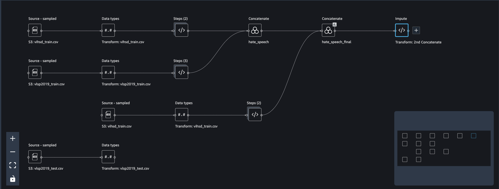

# Đồ án điện toán đám mây - 2022
## Đề tài: Xây dựng ứng dụng phát hiện ngôn từ thù ghét sử dụng AWS SageMaker

> 
    Nguyễn Thanh Sang   - 19133048
    Lê Thị Nhung        - 19133043


## 1. Diagram 

## 2. Dịch vụ sử dụng
-   AWS S3:
    -   Store training data
    -   Store pre-trained model 
-   AWS SageMaker:
    -   Data Wrangling
    -   Training 
    -   Deploy Endpoint
-   AWS EC2:
    -   Deploy streamlit webapp
## 2. Quy trình
### 2.1 Chuẩn bị dữ liệu
#### 2.1.1 Nguồn dữ liệu
-   VIHSD
-   VLSP 

#### 2.1.2 Tiền xử lý dữ liệu (Dataflow.flow)

-   Xử lý tên cột
-   Balancing dữ liệu
-   Visualize đơn giản
## 2.2 Train Model(./Sagemaker/Training.ipynb)
## 2.3 Upload to Huggingface Hub
### 2.3.1 Create repo trên Huggingface Hub


Trong training notebook
```python
trainer.push_to_hub()
```
## 2.3 Start Sagemaker enpoint
```python
from sagemaker.huggingface import HuggingFaceModel
import sagemaker

role = sagemaker.get_execution_role()
# Hub Model configuration. https://huggingface.co/models
hub = {
	'HF_MODEL_ID':'tsdocode/phobert-finetune-hatespeech',
	'HF_TASK':'text-classification'
}

# create Hugging Face Model Class
huggingface_model = HuggingFaceModel(
	transformers_version='4.17.0',
	pytorch_version='1.10.2',
	py_version='py38',
	env=hub,
	role=role, 
)

# deploy model to SageMaker Inference
predictor = huggingface_model.deploy(
	initial_instance_count=1, # number of instances
	instance_type='ml.m5.xlarge' # ec2 instance type
)

predictor.predict({
	'inputs': "ngu vcl",
    'return_all_scores' : True
})
```
## 2.4 Inference
- Start một EC2 instance
- Thêm AWS credentials vào ~/.aws/credentials
- Sử dụng Boto3 để invoke Sagemaker enpoint 


Code invoke SageMaker Endpoint
```python
@st.cache(allow_output_mutation=True)
def load_endpoint():
    sagemaker_session = Session(boto_session=boto3.session.Session())

    predictor = HuggingFacePredictor(
        endpoint_name='huggingface-pytorch-inference-2022-05-07-04-03-22-044', 
        sagemaker_session=sagemaker_session
    )

    return predictor
```

Start web APP

```
streamlit run app.py
```

## 3 Kết quả


## 4. Discord Bot
```
python Bot/bot.py
```


